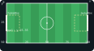
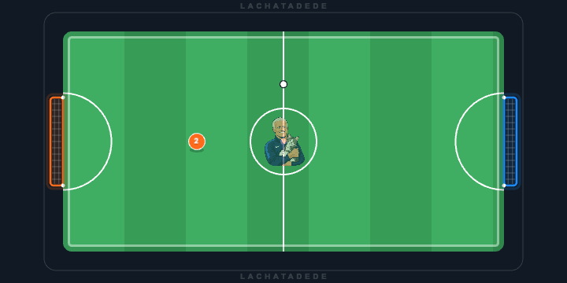
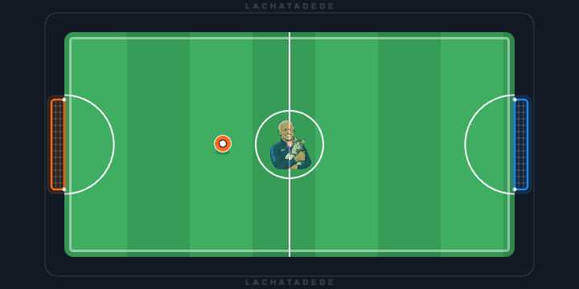
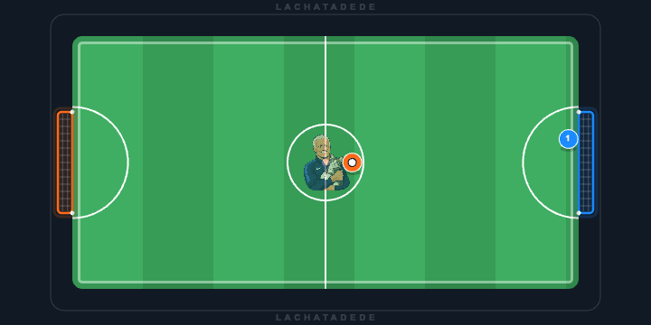
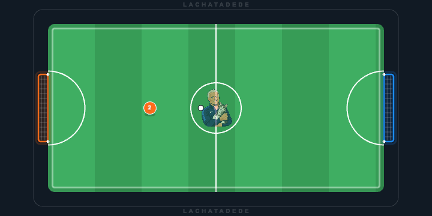
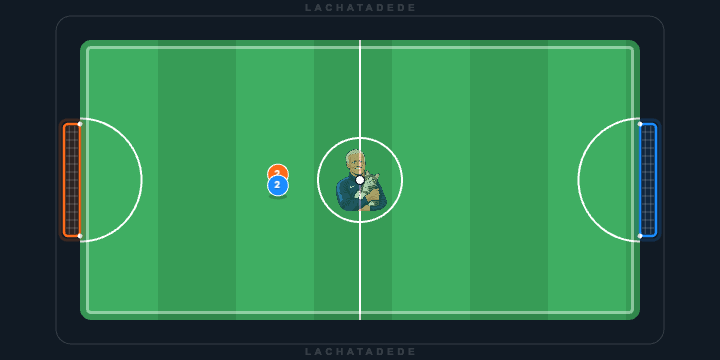

# Scripting Reference — Actions & Game Context

Every player runs one AI script. The engine calls your `update()` function **60 times per second** (one *tick*); each call you may perform **at most one action**. The game state is available as the **global `game`** — no parameter, no JSDoc — and helper functions can read it directly. The legacy `update(game)` parameter style still works. This page is the hands-on guide: what each action does on the pitch, what your script can read, and the warnings you can trigger.

> The full contractual spec lives in [`script-ia-api.md`](../_bmad-output/planning-artifacts/script-ia-api.md) (sandboxing limits, error types, payload shapes). This page shows the behavior.

**Every animation below is real.** Each GIF was produced by running the actual deterministic engine on a minimal situation, then rendering the result with the actual match canvas. Nothing is hand-drawn. See [Regenerating](#regenerating).

## The mirror law (read this first)

**Your script always sees its own goal at `x=0` and the opponent goal at `x=100` — you always attack from left to right.** No matter which side of the real pitch your team plays on, the engine hands your script the whole pitch in that attacking frame: every coordinate you read or pass to an action lives there.

You never compute a home/away distinction: there is no `team` property, no conditional on which side you play. The same script behaves identically in both seats — that is the whole point. The replay canvas always shows the real pitch orientation; the frame flip happens between your script and the engine, never on screen.

---

## The field (coordinates — your attacking frame)



| Thing | Value |
|---|---|
| Width (x) | `0 → 100`, left to right — **your goal at 0, the opponent goal at 100** |
| Height (y) | `0 → 50`, **top to bottom** (y grows downward) |
| Goals | `field.ownGoal` on `x = 0`, `field.opponentGoal` on `x = 100`; mouth spans `y = 15 → 35` |
| Zones | `field.ownBox` = x 0–16, `field.opponentBox` = x 84–100 (both y 15–35); `field.center` = `(50, 25)` |

Speeds worth knowing: a player moves **0.3535 units/tick** (~21 units/s); a carrier moves at **0.8×** that; a full-power ball flies at **1.76 units/tick** and decays with friction **0.9583/tick**. A player takes (or tackles) the ball within **2.0 units** of it.

---

## The actions

Only `me` has action methods. Per tick, the **first** action wins; later calls are warned and ignored.

### `me.moveToward(x, y)` — run somewhere

Moves you toward the target at full speed. **It never touches the ball** — and if you currently own the ball, it **releases it where you stand**.



```js
function update() {
  const { me } = game;
  me.moveToward(70, 25); // run to the right — the ball is not involved
}
```

> **The law:** touching the ball gains possession, but possession is not carrying. If you own the ball and call `moveToward`, you drop it.

### `me.dribble(x, y)` — carry the ball

The only way to take the ball somewhere. You move at carrier speed (0.8×) and the ball stays glued to your feet. Requires possession.



```js
const waypoints = [
  { x: 45, y: 15 },
  { x: 55, y: 35 },
  { x: 65, y: 15 },
];
let next = 0;

function update() {
  const { me } = game;
  const target = waypoints[next];
  if (next < waypoints.length - 1) {
    const dx = target.x - game.me.position.x;
    const dy = target.y - game.me.position.y;
    if (Math.hypot(dx, dy) < 1.5) next++;
  }
  me.dribble(waypoints[next].x, waypoints[next].y);
}
```

### `me.shoot(x, y, power)` — kick the ball

Releases the ball toward `(x, y)` at `power × 1.76` units/tick. `power` is clamped to **0.1 – 1.0** (a non-finite value becomes `1.0`). By the engine's scoring law, an on-target kick is a **TIR** (shot) and an off-target kick is a **PASSE** (pass) — there is no separate pass action.



```js
function update() {
  const { me } = game;
  if (game.ball.owner === me && game.me.position.x < 65) {
    me.dribble(65, 25);       // carry toward the edge of the box
  } else if (game.ball.owner === me) {
    me.shoot(100, 32, 1.0);   // full power into the corner
  } else {
    me.stop();
  }
}
```

*(In the demo, the keeper's script centers on his line, then freezes — the corner still beats him.)*

### `me.stop()` — park

Halts you where you stand. The rest of the world keeps moving.



```js
let ticks = 0;

function update() {
  const { me } = game;
  if (ticks++ < 40) {
    me.moveToward(game.ball.position.x, game.ball.position.y); // chase
  } else {
    me.stop(); // park — the ball keeps rolling
  }
}
```

### `moveToward` vs `dribble` — the race that explains it all

Two players, the same starting line, one free ball. The mover reaches it first — and cannot take it anywhere. The dribbler tackles him and carries it off.



Mover's script (challenger):

```js
function update() {
  const { me } = game;
  if (game.ball.owner === null) {
    me.moveToward(game.ball.position.x, game.ball.position.y); // race to the ball
  } else {
    me.stop();
  }
}
```

Dribbler's script (opponent seat — the same attacking frame: its world-space carry to x=70 is `100 - 70 = 30` in its own view):

```js
function update() {
  const { me } = game;
  if (game.ball.owner === me) {
    me.dribble(30, 25); // carry it away (world x=70 through the mirror)
  } else {
    me.moveToward(game.ball.position.x, game.ball.position.y);
  }
}
```

---

## Reading the game

The `game` object, rebound by the sandbox to the current tick's snapshot before every `update()` call (helpers read it too):

```ts
interface Game {
  me: Player;           // this player — the ONLY one with action methods
  ball: Ball;
  teammates: Player[];  // without you
  opponents: Player[];
  field: Field;
}
```

### `me` (and every player in `teammates` / `opponents`)

| Member | Type | Notes |
|---|---|---|
| `position` | `{ x, y }` | x 0–100 (your goal at 0), y 0–50 |
| `slot` | `1 – 5` | jersey number |
| `isTeammate` | `boolean` | true for you and your teammates, false for opponents |
| `moveToward(x, y)` | action | `me` only |
| `dribble(x, y)` | action | `me` only |
| `shoot(x, y, power)` | action | `me` only |
| `stop()` | action | `me` only |

There is deliberately **no** `hasBall`, **no** `team`, **no** `isClosestToBall()` and **no** `moveTo` alias anymore (v3.0):

- possession is `ball.owner === me` — identity, not a flag;
- the side you play on does not exist in the script view (the mirror law);
- "am I closest to the ball?" is two lines: compare the `Math.hypot` distance from `me.position` to `ball.position` with each teammate's distance to it;
- `moveTo` was a compatibility alias of `moveToward` — call `moveToward` instead.

### `game.ball`

| Member | Type | Notes |
|---|---|---|
| `position` | `{ x, y }` | your attacking frame |
| `velocity` | `{ vx, vy }` | units per tick |
| `owner` | `Player \| null` | the actual player object — `ball.owner === me`, `ball.owner.isTeammate` — or `null` when free |

### `game.field`

| Member | Type | Notes |
|---|---|---|
| `width` / `height` | `100` / `50` | |
| `ownGoal` | `{ x, y, width }` | `x: 0`, `y: 25`, `width: 20` — defend it |
| `opponentGoal` | `{ x, y, width }` | `x: 100` — same geometry, attack it |
| `ownBox` | `Zone` | x 0–16, y 15–35 |
| `opponentBox` | `Zone` | x 84–100, y 15–35 |
| `center` | `{ x, y }` | `(50, 25)` |

Identical for every seat: the frame never flips — see the diagram above.

---

## Tick rules & warnings

| Rule | Behavior |
|---|---|
| One action per tick | Only the **first** recorded action applies; later calls log a `MULTIPLE_ACTIONS` warning |
| `dribble` / `shoot` without the ball | Warning (`DRIBBLE_NO_BALL` / `SHOOT_NO_BALL`), the call is ignored — and it does **not** consume the tick's action budget |
| `power` out of range | Clamped to 0.1–1.0; a non-finite value becomes 1.0 |
| `console.log/warn/error` | Captured as `CONSOLE` logs in the replay (max 100 entries/tick, messages truncated at 500 chars) |
| Missing `update` | The script errors with *"missing update function"* |
| `kick` / `kickBall` | Deliberately **not** provided — an aimed kick IS `shoot` (on-target = tir, off-target = passe) |

---

## Regenerating

The assets on this page are generated tooling, not art:

```bash
npm run docs:scripting
```

- `lachatadede-engine` simulates the five situations (deterministic, seed 42) and writes `scripting/frames/*.json` — byte-identical on every run; treat them as golden fixtures: if a physics change makes a regenerated frame file differ, the docs must be re-reviewed.
- Playwright drives the real `TacticsCanvas` in a headless browser and assembles `scripting/img/*.gif`.
- `field-coordinates.svg` is generated from the engine's real `FIELD_DATA` constants.
